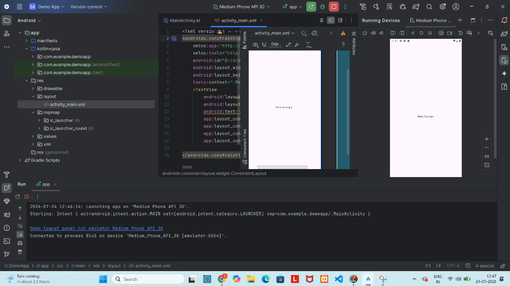

# Demo App - Android Studio Project

An Android application built using Kotlin in Android Studio.

## 📱 Screenshot



## ✨ Features

- **Language:** Kotlin
- **UI Framework:** Android XML with `ConstraintLayout`
- **Minimum SDK:** Android 8.0 (API Level 26)
- **Target SDK:** Android 14 / API Level 34+
- **Architecture:** Standard Android App Structure with edge-to-edge support

## 📁 Project Structure

```
DemoApp/
├── app/
│   ├── src/
│   │   ├── main/
│   │   │   ├── java/com/example/demoapp/
│   │   │   │   └── MainActivity.kt
│   │   │   └── res/
│   │   │       ├── layout/
│   │   │       │   └── activity_main.xml
│   │   │       └── values/
│   │   │           ├── colors.xml
│   │   │           ├── strings.xml
│   │   │           └── themes.xml
│   │   └── AndroidManifest.xml
│   └── build.gradle.kts
├── build.gradle.kts
├── settings.gradle.kts
└── README.md
```

## 🚀 Getting Started

### Prerequisites

- [Android Studio](https://developer.android.com/studio) (latest version recommended)
- JDK 17 or higher
- Android SDK (API 34+)

### Building and Running

1. **Clone the Repository:**
   ```bash
   git clone https://github.com/swarupa-2003/Android-studio.git
   ```
2. **Open in Android Studio:**
   - Open Android Studio.
   - Select **Open an Existing Project** and select the cloned directory.
3. **Sync Gradle:**
   - Allow Android Studio to sync the Gradle dependencies automatically.
4. **Run the Application:**
   - Connect an Android device or launch an Emulator.
   - Click **Run** (`Shift + F10`) to build and run the app.

---

Developed by [swarupa-2003](https://github.com/swarupa-2003).
